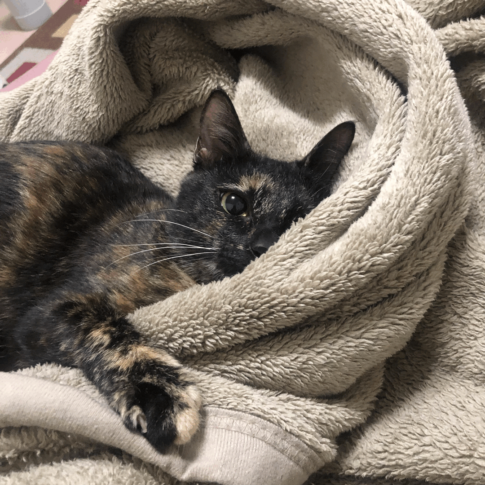

<h1 align="center">Hi 👋, I'm Peter</h1>

  

<h3 align="center">A software engineer from Taiwan</h3>

I am a _Python Programmer_, usually developing _backend services_, such as RESTful API and scheduler.

My development experience covers _DevOps_ like _CI/CD_ with automation tools.

I am also involved in related fields such as _AIoT_, _Blockchain_, and _Security_.

<h1 align="center">BTW, would you like to see my cat do a backflip?</h1>

<!-- output starts -->

Cat is Sleeping... Zzz

## Control Panel

Choose your favorite one

| play | sleep | eat |
| :---: | :---: | :---: |
| [🍀](https://github.com/ttw225/test/issues/new?title=cat%7Cplay%7CCatnip&body=Just+push+%27Submit+new+issue%27+and+go+back+to+README.+You+don%27t+need+to+do+anything+else.&labels=Play) &nbsp; [🎣](https://github.com/ttw225/test/issues/new?title=cat%7Cplay%7CCat_Teaser_Wand&body=Just+push+%27Submit+new+issue%27+and+go+back+to+README.+You+don%27t+need+to+do+anything+else.&labels=Play) &nbsp; [📦](https://github.com/ttw225/test/issues/new?title=cat%7Cplay%7CBox&body=Just+push+%27Submit+new+issue%27+and+go+back+to+README.+You+don%27t+need+to+do+anything+else.&labels=Play) | [🛌](https://github.com/ttw225/test/issues/new?title=cat%7Csleep%7CSleep_Well&body=Just+push+%27Submit+new+issue%27+and+go+back+to+README.+You+don%27t+need+to+do+anything+else.&labels=Sleep) &nbsp; [💫](https://github.com/ttw225/test/issues/new?title=cat%7Csleep%7CAngle&body=Just+push+%27Submit+new+issue%27+and+go+back+to+README.+You+don%27t+need+to+do+anything+else.&labels=Sleep) &nbsp; [☀️](https://github.com/ttw225/test/issues/new?title=cat%7Csleep%7CSun&body=Just+push+%27Submit+new+issue%27+and+go+back+to+README.+You+don%27t+need+to+do+anything+else.&labels=Sleep) &nbsp; [👁️](https://github.com/ttw225/test/issues/new?title=cat%7Csleep%7CBlanket&body=Just+push+%27Submit+new+issue%27+and+go+back+to+README.+You+don%27t+need+to+do+anything+else.&labels=Sleep) | [🥫](https://github.com/ttw225/test/issues/new?title=cat%7Ceat%7CCan&body=Just+push+%27Submit+new+issue%27+and+go+back+to+README.+You+don%27t+need+to+do+anything+else.&labels=Eat) &nbsp; [🧆](https://github.com/ttw225/test/issues/new?title=cat%7Ceat%7CKibble&body=Just+push+%27Submit+new+issue%27+and+go+back+to+README.+You+don%27t+need+to+do+anything+else.&labels=Eat) |

<!-- [🎩](https://github.com/ttw225/test/issues/new?title=cat%7Cfun%7Cheadgear&body=Just+push+%27Submit+new+issue%27+and+go+back+to+README.+You+don%27t+need+to+do+anything+else.&labels=Fun) -->

<!-- output ends -->
