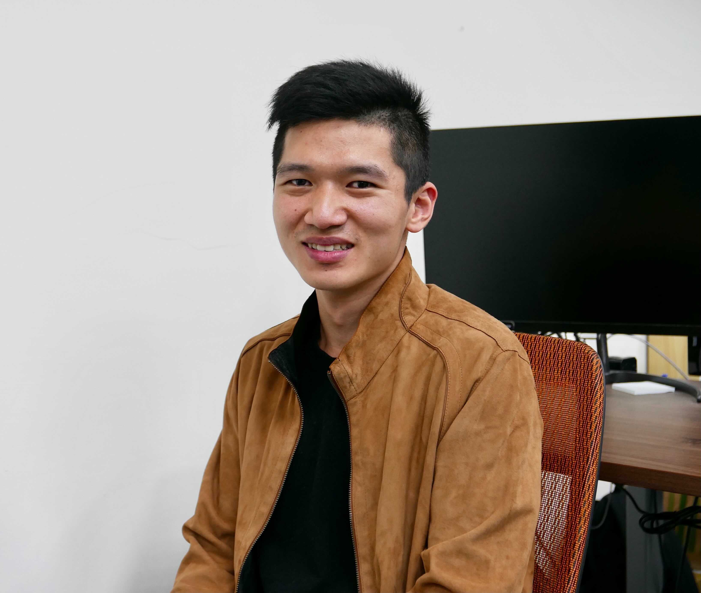

<h1 align="center">Hi 👋, I'm Peter</h1>

  

<h3 align="center">A software engineer from Taiwan</h3>

He is a Backend Engineer with over two years of hands-on experience in developing robust RESTFul API services using Flask and PostgreSQL, complemented by practical DevOps automation skills.

His diverse portfolio showcases contributions to cutting-edge projects in AIoT, blockchain, energy management systems, and the application of security best practices.

## Current Focus

- Program & PR Team Volunteer | PyCon Taiwan 2025
- Building scalable backend systems and APIs

My [resume](https://lihi.cc/TFrst) and [LinkedIn profile](https://www.linkedin.com/public-profile/settings?lipi=urn%3Ali%3Apage%3Ad_flagship3_profile_self_edit_contact-info%3BbRr1vgBBRUCD2dOFW8fosA%3D%3D) are now available for viewing.

<h1 align="center">Would you like to see my cat do a backflip?</h1>

黑糖 (Black Sugar)

<!-- output starts -->

Cat is Eating a Can 😋

## Control Panel

Choose your favorite one

| play | sleep | eat |
| :---: | :---: | :---: |
| [🍀](https://github.com/ttw225/ttw225/issues/new?title=cat%7Cplay%7CCatnip&body=Just+push+%27Submit+new+issue%27+and+go+back+to+README.+You+don%27t+need+to+do+anything+else.&labels=Play) &nbsp; [🎣](https://github.com/ttw225/ttw225/issues/new?title=cat%7Cplay%7CCat_Teaser_Wand&body=Just+push+%27Submit+new+issue%27+and+go+back+to+README.+You+don%27t+need+to+do+anything+else.&labels=Play) &nbsp; [📦](https://github.com/ttw225/ttw225/issues/new?title=cat%7Cplay%7CBox&body=Just+push+%27Submit+new+issue%27+and+go+back+to+README.+You+don%27t+need+to+do+anything+else.&labels=Play) | [🛌](https://github.com/ttw225/ttw225/issues/new?title=cat%7Csleep%7CSleep_Well&body=Just+push+%27Submit+new+issue%27+and+go+back+to+README.+You+don%27t+need+to+do+anything+else.&labels=Sleep) &nbsp; [💫](https://github.com/ttw225/ttw225/issues/new?title=cat%7Csleep%7CAngle&body=Just+push+%27Submit+new+issue%27+and+go+back+to+README.+You+don%27t+need+to+do+anything+else.&labels=Sleep) &nbsp; [☀️](https://github.com/ttw225/ttw225/issues/new?title=cat%7Csleep%7CSun&body=Just+push+%27Submit+new+issue%27+and+go+back+to+README.+You+don%27t+need+to+do+anything+else.&labels=Sleep) &nbsp; [👁️](https://github.com/ttw225/ttw225/issues/new?title=cat%7Csleep%7CBlanket&body=Just+push+%27Submit+new+issue%27+and+go+back+to+README.+You+don%27t+need+to+do+anything+else.&labels=Sleep) | [🥫](https://github.com/ttw225/ttw225/issues/new?title=cat%7Ceat%7CCan&body=Just+push+%27Submit+new+issue%27+and+go+back+to+README.+You+don%27t+need+to+do+anything+else.&labels=Eat) &nbsp; [🧆](https://github.com/ttw225/ttw225/issues/new?title=cat%7Ceat%7CKibble&body=Just+push+%27Submit+new+issue%27+and+go+back+to+README.+You+don%27t+need+to+do+anything+else.&labels=Eat) |

<!-- [🎩](https://github.com/ttw225/ttw225/issues/new?title=cat%7Cfun%7Cheadgear&body=Just+push+%27Submit+new+issue%27+and+go+back+to+README.+You+don%27t+need+to+do+anything+else.&labels=Fun) -->

## Latest Participants

| user |
| :---: |
| [ttw225](https://github.com/ttw225) |
| [leo271828](https://github.com/leo271828) |

## Top 20 LeaderBoard: 黑糖's Best Friends

| times | user |
| :---: | :---: |
| 6 | [ttw225](https://github.com/ttw225) |
| 2 | [leo271828](https://github.com/leo271828) |

<!-- output ends -->
